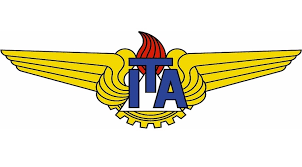

<table><tr>
<td>

    </td>
<td>

    </td>
    </tr></table

# EMBRAER | ITA

## ENGENHARIA AERONÁUTICA E MECÂNICA - PEE 30

### AC-701 : SISTEMAS PROPULSIVOS - PROF. LACAVA

### Autores:

* Camilla Santos
* Eloi Antonio
* Gabriel Henrique
* Jonas Degrave
* Lucas Schroeder
* Matheus Monteverde
* Orlando Gabriel
* Rafael Bayão

## Turbojato:

* a
* b

## Turbofan:

* c
* d

## Turbohélice:

* e
* f

## Ramjet:

* g
* h
